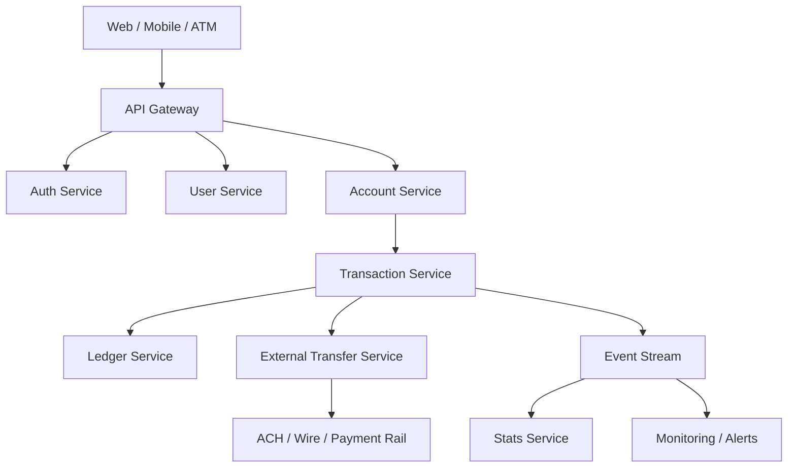

```mermaid
flowchart TD
    A["Web / Mobile / ATM"] --> B["API Gateway"]
    B --> C["Auth Service"]
    B --> D["User Service"]
    B --> E["Account Service"]
    E --> F["Transaction Service"]
    F --> G["Ledger Service"]
    F --> H["External Transfer Service"]
    H --> I["ACH / Wire / Payment Rail"]
    F --> J["Event Stream"]
    J --> K["Stats Service"]
    J --> L["Monitoring / Alerts"]
```
