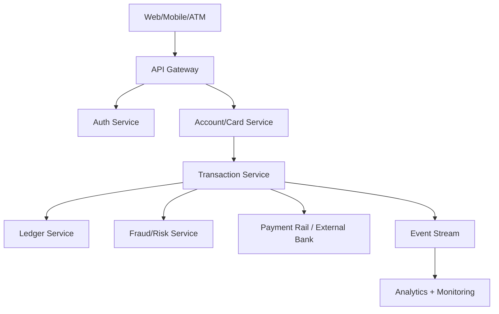

```mermaid
flowchart TD
    A["Web/Mobile/ATM"] --> B["API Gateway"]
    B --> C["Auth Service"]
    B --> D["Account/Card Service"]
    D --> E["Transaction Service"]
    E --> F["Ledger Service"]
    E --> G["Fraud/Risk Service"]
    E --> H["Payment Rail / External Bank"]
    E --> I["Event Stream"]
    I --> J["Analytics + Monitoring"]
```
