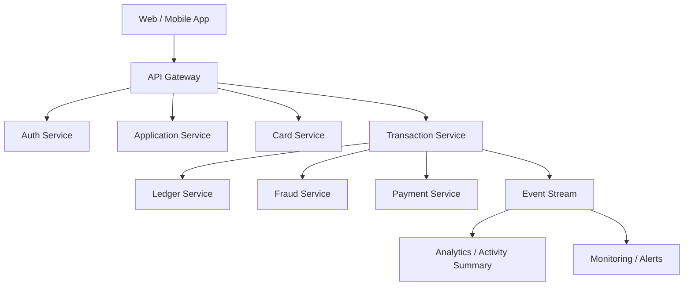

```mermaid
flowchart TD
    A["Web / Mobile App"] --> B["API Gateway"]
    B --> C["Auth Service"]
    B --> D["Application Service"]
    B --> E["Card Service"]
    B --> F["Transaction Service"]
    F --> G["Ledger Service"]
    F --> H["Fraud Service"]
    F --> I["Payment Service"]
    F --> J["Event Stream"]
    J --> K["Analytics / Activity Summary"]
    J --> L["Monitoring / Alerts"]
```
