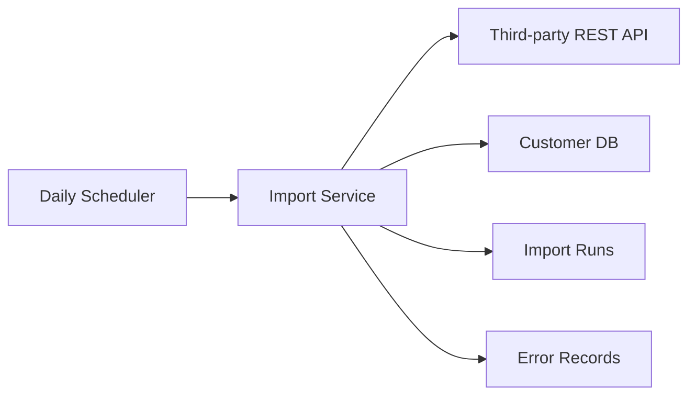

```mermaid
flowchart LR
    S["Daily Scheduler"] --> I["Import Service"]
    I --> A["Third-party REST API"]
    I --> DB["Customer DB"]
    I --> R["Import Runs"]
    I --> DLQ["Error Records"]
```
