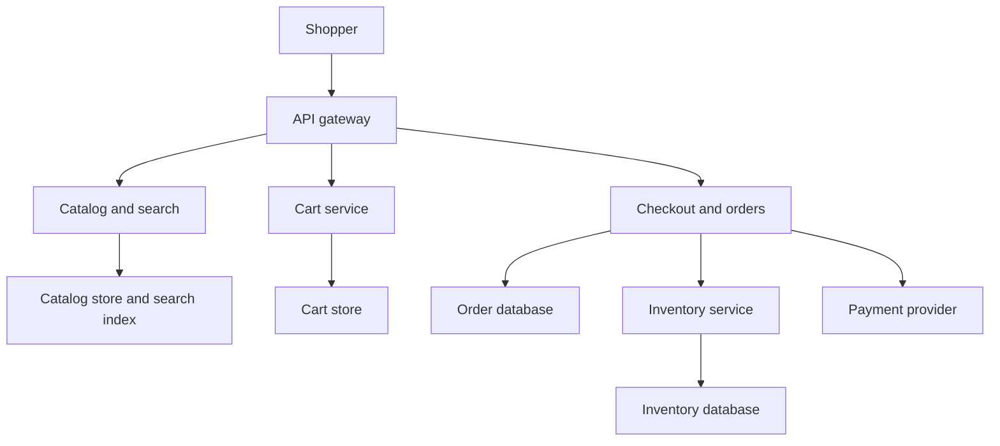

```mermaid
flowchart TD
    U["Shopper"] --> G["API gateway"]
    G --> P["Catalog and search"]
    G --> C["Cart service"]
    G --> O["Checkout and orders"]
    P --> S["Catalog store and search index"]
    C --> D["Cart store"]
    O --> B["Order database"]
    O --> I["Inventory service"]
    O --> Y["Payment provider"]
    I --> R["Inventory database"]
```
