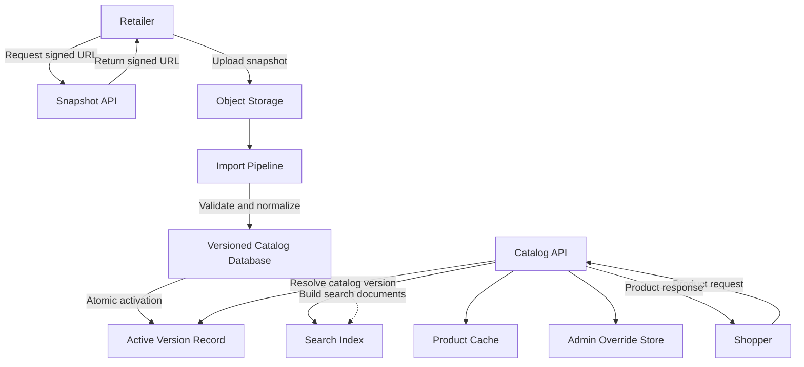

```mermaid
flowchart TD
    Retailer[Retailer]
    SnapshotAPI[Snapshot API]
    ObjectStorage[Object Storage]
    ImportPipeline[Import Pipeline]
    CatalogDB[Versioned Catalog Database]
    ActiveVersion[Active Version Record]
    CatalogAPI[Catalog API]
    Shopper[Shopper]
    ProductCache[Product Cache]
    SearchIndex[Search Index]
    OverrideStore[Admin Override Store]

    Retailer -->|Request signed URL| SnapshotAPI
    SnapshotAPI -->|Return signed URL| Retailer
    Retailer -->|Upload snapshot| ObjectStorage
    ObjectStorage --> ImportPipeline
    ImportPipeline -->|Validate and normalize| CatalogDB
    CatalogDB -->|Atomic activation| ActiveVersion

    Shopper -->|Product request| CatalogAPI
    CatalogAPI -->|Resolve catalog version| ActiveVersion
    CatalogAPI --> ProductCache
    CatalogAPI --> SearchIndex
    CatalogAPI --> OverrideStore
    CatalogAPI -->|Product response| Shopper

    CatalogDB -.->|Build search documents| SearchIndex
```
