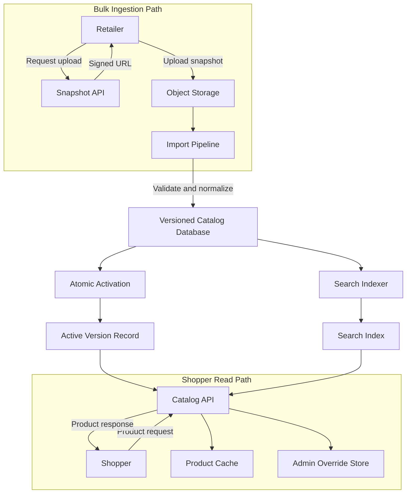

```mermaid
flowchart TB
    subgraph Ingestion["Bulk Ingestion Path"]
        direction LR
        Retailer[Retailer]
        SnapshotAPI[Snapshot API]
        ObjectStorage[Object Storage]
        ImportPipeline[Import Pipeline]

        Retailer -->|Request upload| SnapshotAPI
        SnapshotAPI -->|Signed URL| Retailer
        Retailer -->|Upload snapshot| ObjectStorage
        ObjectStorage --> ImportPipeline
    end

    CatalogDB[Versioned Catalog Database]
    Activation[Atomic Activation]
    ActiveVersion[Active Version Record]
    SearchIndexer[Search Indexer]
    SearchIndex[Search Index]

    ImportPipeline -->|Validate and normalize| CatalogDB
    CatalogDB --> Activation
    Activation --> ActiveVersion
    CatalogDB --> SearchIndexer
    SearchIndexer --> SearchIndex

    subgraph Serving["Shopper Read Path"]
        direction LR
        Shopper[Shopper]
        CatalogAPI[Catalog API]
        ProductCache[Product Cache]
        OverrideStore[Admin Override Store]

        Shopper -->|Product request| CatalogAPI
        CatalogAPI --> ProductCache
        CatalogAPI --> OverrideStore
        CatalogAPI -->|Product response| Shopper
    end

    ActiveVersion --> CatalogAPI
    SearchIndex --> CatalogAPI
```
