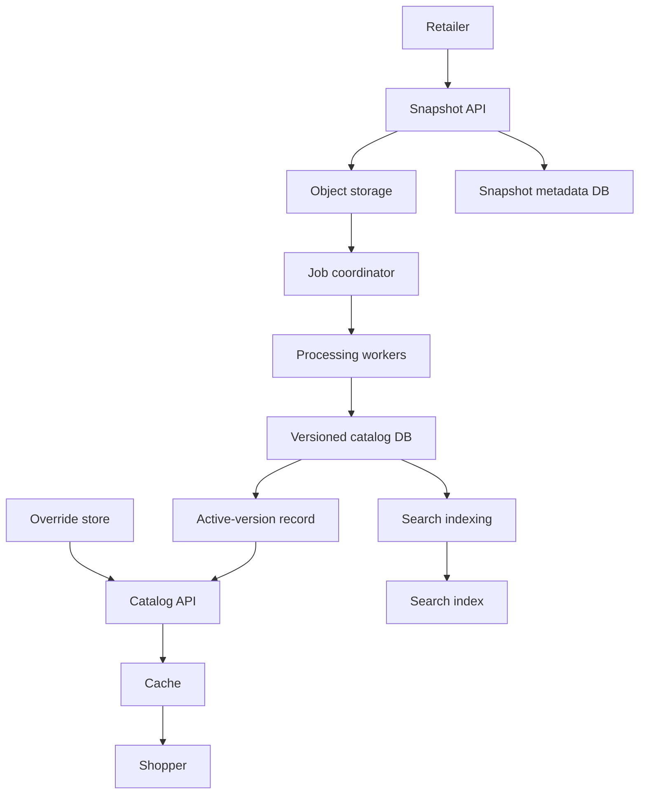

```mermaid
flowchart TD
    A["Retailer"] --> B["Snapshot API"]
    B --> C["Object storage"]
    B --> D["Snapshot metadata DB"]
    C --> E["Job coordinator"]
    E --> F["Processing workers"]
    F --> G["Versioned catalog DB"]
    G --> H["Active-version record"]
    G --> I["Search indexing"]
    J["Override store"] --> K["Catalog API"]
    H --> K
    I --> L["Search index"]
    K --> M["Cache"]
    M --> N["Shopper"]
```
